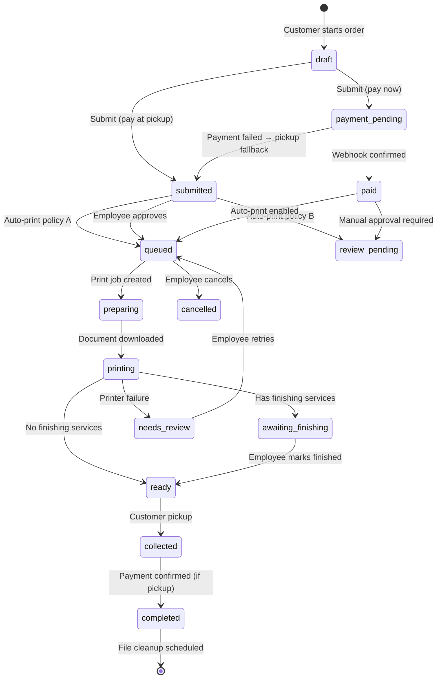

# Order Lifecycle

## Order States (Internal)

```
draft → submitted → payment_pending → paid → review_pending → queued →
preparing → printing → awaiting_finishing → ready → collected → completed

Terminal states: cancelled, failed
Special: needs_review (printer incompatibility / failure)
```

## Customer-Facing Arabic Statuses

| Internal State | Arabic Display |
|----------------|----------------|
| `submitted` | تم استلام الطلب |
| `payment_pending` | بانتظار الدفع |
| `paid` | تم الدفع |
| `review_pending` | قيد المراجعة |
| `queued` | بانتظار الطباعة |
| `preparing` | جاري التجهيز |
| `printing` | جاري الطباعة |
| `awaiting_finishing` | بانتظار التجهيز |
| `ready` | جاهز للاستلام |
| `collected` | تم الاستلام |
| `completed` | تم الاستلام |
| `cancelled` | تم الإلغاء |
| `failed` | تعذر تنفيذ الطلب |
| `needs_review` | يحتاج مراجعة |

---

## State Machine



---

## Order Number Generation

- Human-readable: `#124` or `P-124`
- Per-store sequential counter (not global)
- Internal: UUID v4 for all API references
- Format: `{prefix}{number}` where prefix is store-configurable (default `#`)

---

## Order Creation Flow

### Pay at Pickup

1. Customer completes file upload + print options + checkout form
2. API validates phone (E.164), pricing, file readiness
3. Order created with status `submitted`
4. Payment status: `unpaid`
5. Apply store policy:
   - **Mode A**: Auto-queue for printing → `queued`
   - **Mode B**: → `review_pending` (employee approval)
   - **Mode C**: Hold until customer arrives (no auto-print)
6. WebSocket push to desktop: `order.created`
7. Return order number + tracking token to customer

### Pay Now (Online)

1. Customer completes checkout, selects "الدفع الآن"
2. Order created with status `payment_pending`
3. Payment session initialized via provider abstraction
4. Customer redirected to payment page
5. On webhook confirmation → status `paid`
6. If auto-print enabled → `queued` → dispatch print job
7. On payment failure → offer retry or pay-at-pickup

---

## Order Document Structure

Each order contains one or more **order items** (documents):

```
Order #124
├── Item 1: assignment.pdf (20 pages)
│   ├── copies: 2
│   ├── color_mode: bw
│   ├── paper_size: A4
│   ├── sides: duplex_long
│   ├── page_range: all
│   └── finishing: [stapling]
├── Item 2: (if multiple files)
└── Customer notes: "..."
```

---

## Tracking

Customer receives secure tracking URL: `/track/{token}`

- Token is unguessable (32+ byte random)
- No login required
- Shows Arabic status timeline
- Does not expose other customer data

---

## Pickup Flow

1. Employee searches by order number, name, or phone
2. Display: customer name, amount, payment status
3. If unpaid → "استلام المبلغ" (cash/card) → confirm
4. If paid → show "مدفوع ✅"
5. Hand documents → "تم التسليم" → `completed`
6. Schedule file deletion per store policy

---

## Required Scenarios (from spec)

### Scenario 1: Online pay + stapling
Paid → auto-print → `awaiting_finishing` (stapling) → employee staples → `ready` → notify → pickup → `completed`

### Scenario 2: Pay at pickup + auto-print
Submitted → auto-print (Mode A) → `ready` → notify → customer arrives unpaid → pay cash → `completed`

### Scenario 3: Printer offline
Paid → print fails → `needs_review` → employee selects new printer → retry → eventually `ready`
